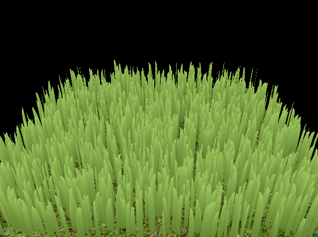
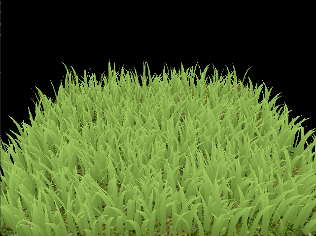
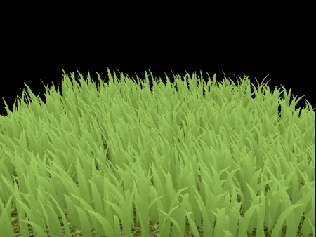
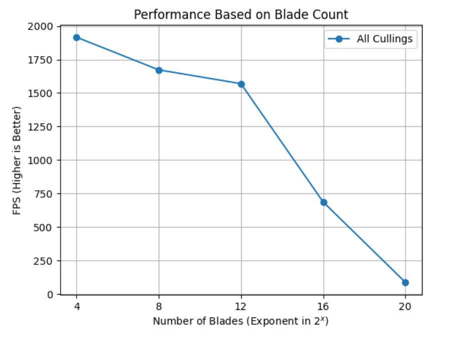
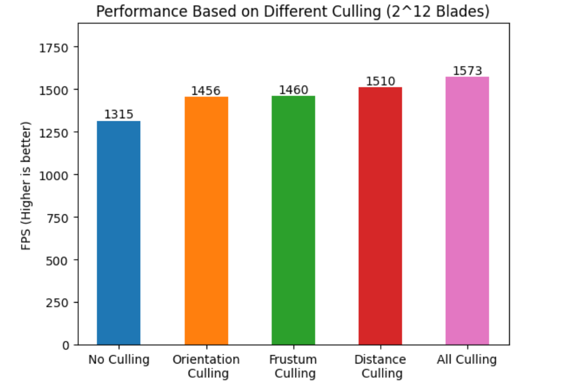

Vulkan Grass Rendering
==================================

**University of Pennsylvania, CIS 565: GPU Programming and Architecture, Project 5**

* Catherine Cheng
  * [LinkedIn](https://www.linkedin.com/in/catherine-wanning-cheng/), [personal website](https://www.catherine-wanning-cheng.com/projects-1)
* Tested on: Windows 11, AMD Ryzen 7 5800H @ 3.20GHz 16GB, NVIDIA GeForce RTX 3070

## Introduction

This project is a Vulkan-based grass simulator and renderer that uses compute shaders for efficient physics calculations on Bezier curves to represent individual grass blades. To optimize rendering, I have used compute shaders to cull unnecessary blades per frame, passing only relevant blades to the graphics pipeline. In the graphics pipeline, I used custom shaders to handle each stage: a vertex shader transforms Bezier control points, tessellation shaders dynamically generate grass geometry, and a fragment shader shades the blades for final visual effects.

This project is an implementation of the paper, [Responsive Real-Time Grass Rendering for General 3D Scenes](https://www.cg.tuwien.ac.at/research/publications/2017/JAHRMANN-2017-RRTG/JAHRMANN-2017-RRTG-draft.pdf)

### Features
- Vulkan setup for grass and compute pipeline
- Tessellating Bezier curves into grass blades
- Force Simulation
    - Gravity
    - Recovery
    - Wind
    - Validation for total forces
- Culling
    - Orientation Culling
    - Frustum Culling
    - Distance Culling

## Representing Grass Using Bezier Curves

In this project, each grass blade is modeled as a Bezier curve to enable realistic physics calculations and efficient culling.

Each Bezier curve is defined by three control points:

- `v0`: The base position of the grass blade on the geometry.
- `v1`: A guide point positioned "above" v0 in alignment with the blade's up vector (explained below).
- `v2`: A control point influenced by simulated forces.
Additionally, each blade has specific attributes that aid in accurate simulation and tessellation:
- `up`: The blade's up vector, representing the normal of the underlying geometry at v0.
Orientation: Defines the blade's facing direction.
- `Height`: The blade's length.
- `Width`: The thickness of the blade's face.
- `Stiffness`: Influences the force interactions acting on the blade.

These characteristics are efficiently packed into four `vec4` structures, where `v0.w` stores orientation, `v1.w` stores height, `v2.w` stores width, and `up.w` holds the stiffness coefficient.

Below is the view when basic grass blades' shapes are set up without any further simulation.

## Simulating Forces on Grass Blades
This project then simulates forces on grass blades, which are calculated within a compute shader in the provided compute pipeline. Since `v2` acts as the physical guide, transformations are applied to it, followed by corrections to maintain realism. Finally, `v1` is adjusted to preserve the intended blade length.

### Gravity Simulation
Gravity is defined using a direction vector, `D.xyz`, and an acceleration magnitude, `D.w`, allowing us to compute environmental gravity, `gE = normalize(D.xyz) * D.w`. The gravity's impact relative to the blade’s forward direction, `f`, results in "front gravity," calculated as `gF = (1/4) * ||gE|| * f`. The total gravity affecting the blade is `g = gE + gF`.

### Recovery Forces
Recovery forces counterbalance gravity, restoring the blade to equilibrium using Hooke's law. This is done by comparing the current `v2` position to its initial state, `iv2`. Initially, `v1` and `v2` are set a distance equal to the blade's height along the up vector. The recovery force is then computed as `r = (iv2 - v2) * stiffness`.

Below is the view when only gravity and recovery forces are applied:

### Wind Simulation
Wind function is a sine-based function that incorporates `v0` (the blade’s base position) and a time variable. The wind force also depends on "wind alignment," where blades more aligned with the wind direction experience a stronger effect. The total wind force, w, is given by `windDirection * windAlignment`.

### Total Force Calculation
Finally, the translation for v2 is determined by combining forces: `F = (gravity + recovery + wind) * deltaTime`. In addition, there are extra adjustments to ensure that v2 remains above ground and that both `v1` and `v2` maintain the blade's intended length according to section 5.2 (State Validation) of the reference paper.

Below is the view with all forces applied:

## Culling Tests

To optimize rendering, while forces are simulated on every grass blade each frame, but we only render those that visibly contribute. Below are heuristics used to cull unnecessary blades.

### Orientation Culling

When a grass blade’s front face is perpendicular to the view vector, it appears smaller than a pixel, potentially causing aliasing. To prevent this, we cull these blades by performing a dot product test between the view vector and the blade’s front face direction. 

### Frustum Culling

Blades outside the view frustum are also culled, as they won’t be visible. To determine visibility, we check three points: `v0`, `v2`, and `m`, where `m = (1/4)v0 + (1/2)v1 + (1/4)v2`. Since `v1` only serves as a guide, `m` provides a more accurate midpoint for visibility checks. 

Culling is applied if all three points are outside the frustum, with a tolerance value to allow conservative culling, ensuring blades near the frustum edges are retained for a more complete visual.

### Distance Culling

Grass blades far from the camera may appear smaller than a pixel, risking rendering artifacts. To manage this, we cull blades based on their distance from the camera. 

The closest bucket retains more blades, with each subsequent bucket culling an increasing number.

## Performance Analysis

### Performance Change By Blade Number
With different number of blades, the performance is shown as below (with orientation, frustum, and distance culling):

In this way, we could see that FPS decreases as the blade number increases. When the number of Blades is greater han $2^{16}$, the runtime (FPS) starts to drop dramatically. 

### Performance Change By Culling

In this project, I have applied three types of culling methods (Orientation Culling, Frustum Culling, and Distance Culling) to optimize the performance as shown below:

Based on the chart, any culling method would result in a faster runtime than when no culling is applied. The amount of runtime optimized would also vary based on the type of culling method and the circumstances (e.g., for distance culling, the FPS would be higher when the camera being far away from the plane). When all three types of culling methods are applied, the render would reach a even higher FPS.